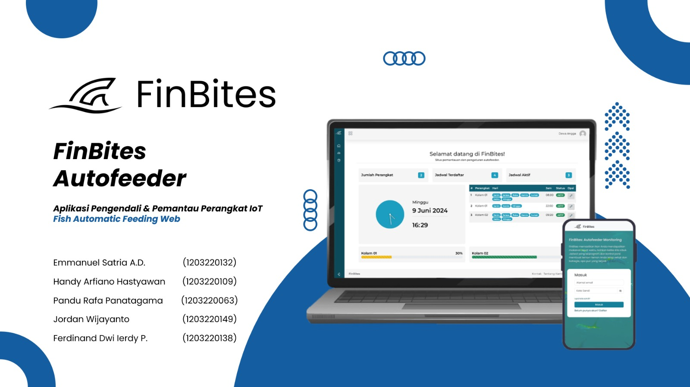

<p align="center"></p>

<h1 align="center" style="font-size: 100px; font-weight: bold"><span style="color: #24D3FF">F</span>in<span style="color: #24D3FF">B</span>ites</h1>

## About FinBites
<p align="justify" style="text-indent: 30px">
FinBites adalah website pengontrol perangkat AutoFeeder yang termasuk dalam lingkungan IOT. Website ini menggunakan MQTT Protokol untuk berkomunikasi antar perangkat IOT. Website berjalan di lingkungan Laravel dan Node JS serta Arduino untuk perangkat IOT nya yang menggunakan mikrokontroller ESP32 WROOM. Terima Kasih pada broker <a href="https://www.emqx.com/en">EMQX</a> telah menjadi broker terpercaya untuk pengembangan projek ini.
</p>

## Features
- Kontrol Jarak Jauh
- Pemberian pakan Otomatis
- Penjadwalan Pakan
- Monitoring Jarak Jauh
- Dll


Banyak lagi fitur FinBites Di dalam website ini yang tidak kami sebutkan.

## Folder Structure
Website ini bekerja di lingkungan laravel dan javascript (Node JS). Maka ada dua point yang harus kami jelaskan:

### ./node_services
<p align="justify" style="text-indent: 30px">
Merupakan projek Node JS yang yang digunakan untuk membangun MQTT Server untuk keperluan komunikasi antar perangkat AutoFeeder. Projek ini menggunakan Node JS v20.14.0 LTS yang sudah distabilkan dengan kebutuhan.
</p>

### ./app
<p align="justify" style="text-indent: 30px">
Merupakan project laravel yang digunakan untuk membangun controller untuk keperluan arsitektur MVC. Folder ini menyimpan bussines logic dari website dan juga beberapa keperluan seperti service dan models.
</p>

## Instalation and Run

<p>
Website ini bekerja di lingkungan laravel dan javascript (Node JS). Perlu diketahui bahwa laravel dan Node JS adalah dua projek yang berbeda, dengan demikian perlu beberapa setup yang bisa di ikuti di bawah ini.
</p>
<p>
Pastikan anda sudah menginstall Laravel 10 dan PHP 8.2 serta Node JS v20.14.0 ke atas.
</p>

```
1. cd ./autofeeder-web-control
2. composer install
3. cd ./node_services
4. npm install
```

<p>
Jika sudah melakukan step di atas, saatnya menjalan semua service yang ada
</p>

```
1. cd ./autofeeder-web-control
2. php artisan serve
3. Open new Termnial
4. cd ./node_services
5. npm start
```


## Contributing

Terima Kasih kepada para kontributor telah bersedia untuk melakukan kontribusi terhadap web ini. Untuk para kontributor baru cukup lakukan fork lalu lakukan PR untuk semua update yang anda berikan.

<h1 align="center" style="font-size: 30px; font-weight:Bold">Poster</h1>

<br/><br/><br/><br/>
<h1 align="center" style="font-size: 30px; font-weight:Bold">Presentation</h1>


<h2 align="center" style="font-size: 20px; font-weight:Bold">Click To See!!!</h2>

## License

Jangan Ngeclaim - Ngeclaim :)
